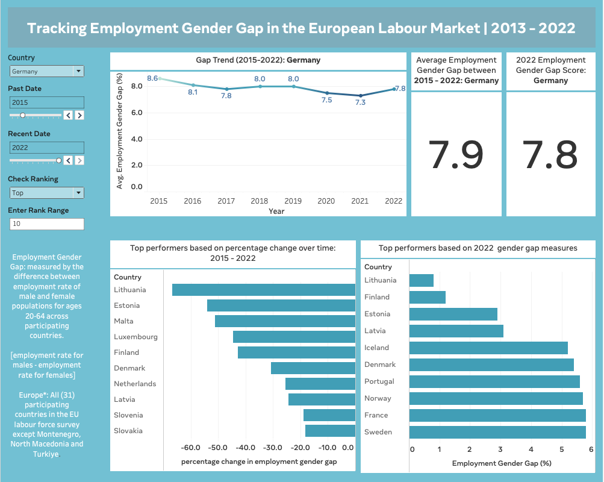

# Interactive Tableau Dashboard Tracking Employment Gender Gap across Europe’s Labour Markets

## Project Backkground
The goal of this project was to primarily build an interactive dashboard with which users could track how employment gender gap was performing over time in the European labour market. Based on the most recent available data the following where set out to be captured on the dashboard:

1. Current (2022) employment gender gap scores across Europe.
2. Average employment gender gap scores for different labour markets in Europe over time.
3. How labour markets across Europe are trending on employment gender gap over time.
4. How countries rank in performance based on 2022 employment gender gap scores.
5. How countries rank in performance based on percentage change over time in employment gender gap scores.

I’ve embeded interactivity to filter based on time, location and rank mode (top or bottom). I’ve also embedded interactivity into texts to capture what each user is looking at per time.

## Tools Employed
1. **Tableau:** for building the worksheets and dashboard. This dashboard and supporting worksheets have used **calculated fields, LODs, parameters and filters** towards embedding interactivity and making extra calculations.
2. **Excel:** Primarily used for checking the data for errors & clean up, transformation and initial analysis.
3. **Excel Power Query:** PowerQuery was only used to transform the data from wide to long since I needed to capture years as row observations and cluster as a new variable - **Year**. Also to capture gender gap scores as row observations and cluster as a new variable - **Gender Gap**.

## About the Data
[Data Source - Eurostat](https://ec.europa.eu/eurostat/databrowser/view/LFSI_EMP_A__custom_5738963/default/table?lang=en) | [Download Data Used](https://drive.google.com/drive/folders/1LIlNbd1OWOQNtNCjaa6fzUJIqajcCel9?usp=share_link)

The data is sourced from Eurostat’s public data repository, which they have collected as survey data. Data from source is customised based on age group, employed statistics for the years 2013 through 2022. The original data set captures employment rate among each gender group (male & female) and does not capture othe gender descriptions. We collected data that captures employment rate among males and females for the age group 20-64 across 31 countries in Europe. For the purpose of this work we have measured employment gender gap as the difference between employment rate among males and employment rate among females (employment gender gap = employment rate among males - employment rate among females).

## Steps Taken to Deliverable
1. Identify key insights to be delivered
2. Extract and prepare data
3. Clean and transform data for analysis
4. Analysis
5. Load Data to Tableau for visualisation
6. Prepare Dashboard

## Delivered Item
[Tableau Dashboard](https://public.tableau.com/views/TrackingEmploymentGenderGapintheEuropeanLabourMarket/EUEmploymentGenderGapTrackingDashboard?:language=en-GB&publish=yes&:display_count=n&:origin=viz_share_link)

